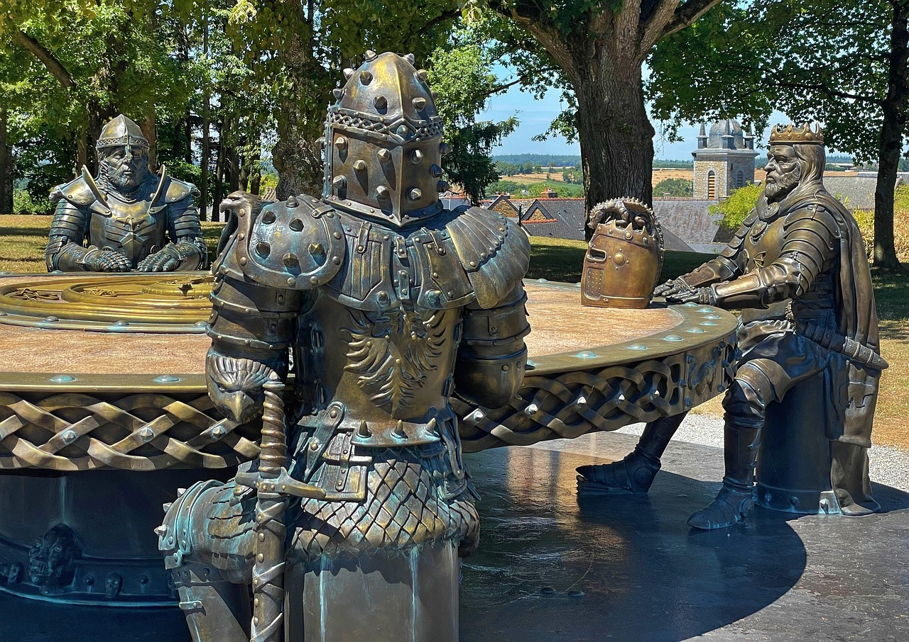

🏰 Knights of the Round Table Registration Form

An interactive medieval form to recruit loyal knights for King Arthur. Includes validation, visual effects, and a Camelot-inspired theme.

✨ Features

✅ Field validation:

Required fields (name, title, email).

Numeric range (1-12) for knight number.

🎇 Visual effects:

Glittering button effect on click.

Animated golden particles upon submission.

⚔️ Immersive theme:

Medieval styling with gold and blue colors.

Questions based on the chivalric code.

🛠️ Technologies

HTML5: Semantic structure.

CSS3: Animations (keyframes), responsive design.

JavaScript: Dynamic validation and effects.

🖥️ How to Use

Clone the repository:

bash
git clone https://github.com/your-username/knight-registration.git

Open index.html in your browser.

Fill out the form and witness the magic on submit. If you want to see the button effect without having to fill in all the required fields, open the script.js folder and follow the instructions in the first commented line.

📝 Requirements

Modern browser (Chrome, Firefox, Edge).

Optional: Local server (e.g., VSCode Live Server) to avoid CORS issues with the image.

🎨 Customization

Change colors: Modify CSS variables:

body {
  background-color: #1b1b43; /* Dark blue background */
  color: #f7aa00; /* Gold text */
}

Add more fields: Extend the HTML form following the same style.
